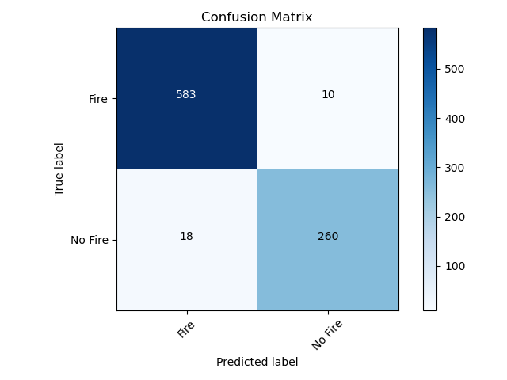

# FireNet-LightWeight-Network-for-Fire-Detection
> A Specialized Lightweight Fire & Smoke Detection Model for Real-Time IoT Applications
>>(Preprint of the research paper on this work is available at https://arxiv.org/abs/1905.11922v2. It will be soon submitted to a conference in the near future.)

In our paper we showed results on two datasets:
- A self created diverse dataset with images randomly sampled from our self-shot fire and non-fire
videos.
- Foggia's dataset (used for testing), which is available here (https://mivia.unisa.it/datasets/video-analysis-datasets/fire-detection-dataset/).

It needs to be mentioned that the data used for training is only our custom created dataset, and not Foggia's full dataset. Testing was performed on previously held-out samples from our dataset as well as on Foggia's dataset. 

The following is the link to our dataset used in the FireNet paper:
- https://drive.google.com/drive/folders/1HznoBFEd6yjaLFlSmkUGARwCUzzG4whq?usp=sharing

## The test result example



```text
tp 583
fn 10
fp 18
tn 260
Precision= 0.9700499168053245 Recall= 0.9831365935919055 f_measure= 0.9765494137353434
```